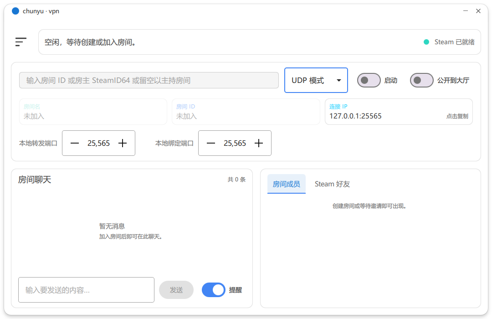
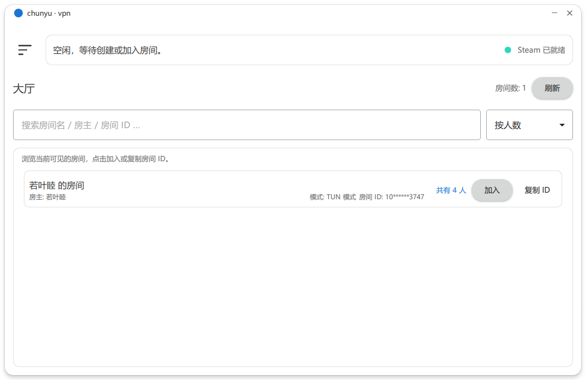
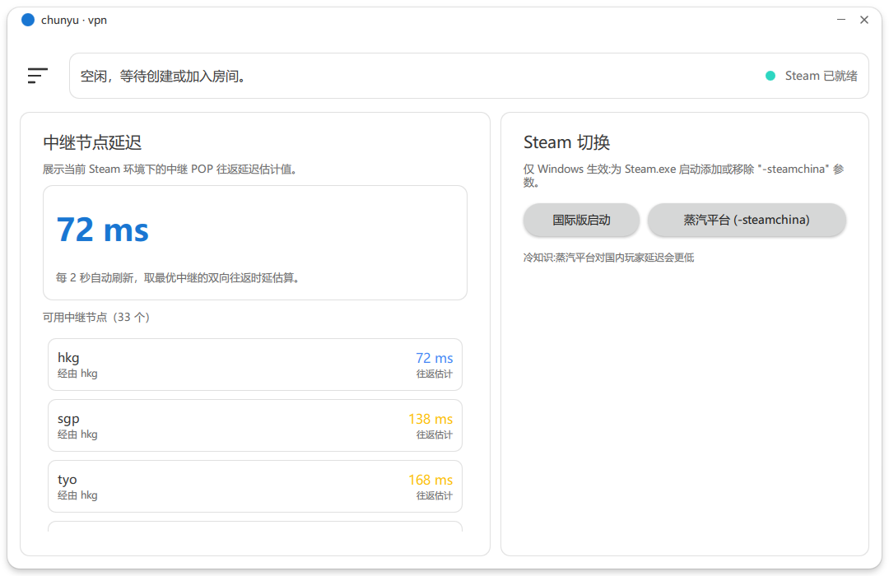
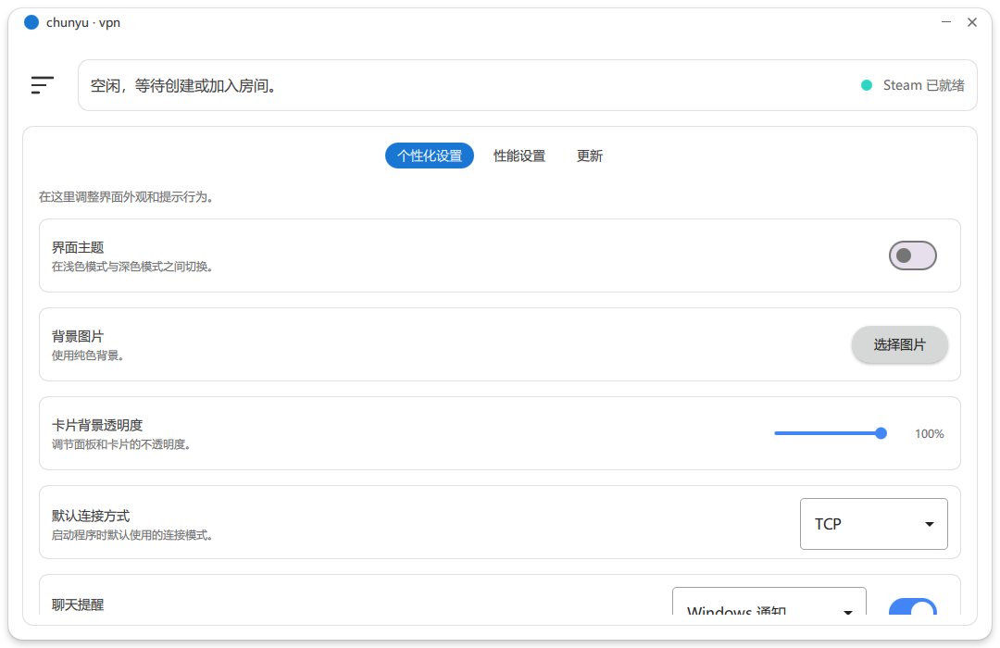

# ChunyuVPN

[](https://github.com/moeleak/connecttool-qt/releases/latest)
[](https://github.com/moeleak/connecttool-qt/releases)
[](https://www.gnu.org/licenses/gpl-3.0)
[](https://github.com/moeleak/connecttool-qt/releases)

 **使用警告**   
使用可能会导致Steam账号被[封禁](https://store.steampowered.com/subscriber_agreement/Steam#2)。若要使用本项目建议用小号。  
online-fix 跟本项目同原理使用 Steam 网络进行联机，从 2017 年开始传播，峰值日活 13w 仍未被 Valve 封禁。**使用风险自负！**

##  项目简介

ChunyuVPN 是一款基于 ConnectTool 重制的图形化 VPN 工具，相比主线分支优化了跨平台支持、网络性能以及拥有更好的 UI 界面。可以利用 Steam Network 进行 TCP/UDP 转发或类似 Tailscale 的异地组网效果（TUN 模式）。

##  主要特性

###  已实现功能
- **跨平台支持**：完美支持 Windows/Linux/macOS
- **双模式支持**：
  - TCP 转发模式：单一端口转发
  - UDP 转发模式：单一端口转发
  - TUN 虚拟网卡模式：跨平台异地组网
- **社交功能**：
  - 房间内文字聊天
  - 右键消息可置顶，让新加入用户快速了解房间信息
- **现代化 UI**：
  - 基于 Qt Quick Controls 2 的现代化界面
  - 支持深色/浅色主题切换
  - 响应式设计，适配不同屏幕尺寸
- **网络优化**：
  - 基于 Steam 网络架构
  - 自动中继节点选择
  - 低延迟连接优化

###  待开发特性
- Android 平台支持
- iOS 平台支持
- Web 管理界面
- 更多高级网络功能

##  界面预览

<div align="center">




</div>

## 📺 视频教程

- [B站傻瓜式教程](https://www.bilibili.com/video/BV1geS4BUEKy)

### 技术讨论
- GitHub Issues：报告 Bug 和请求功能
- QQ 群：实时技术交流和用户支持

##  快速开始

### Windows 用户
1. 前往 [Releases 页面](https://github.com/liangcka/chunyu-vpn/releases) 下载最新版本
2. 解压后运行 `connecttool-qt.exe`
3. 按照界面提示进行配置

### Linux/macOS 用户
```bash
# 安装依赖（以 Ubuntu 为例）
sudo apt-get install qt6-base-dev qt6-declarative-dev build-essential cmake

# 克隆仓库
git clone https://github.com/liangcka/chunyu-vpn.git
cd chunyu-vpn

# 构建项目
mkdir build && cd build
cmake ..
make -j$(nproc)

# 运行
./connecttool-qt
```

### Nix 用户
```bash
# 首先安装好 nix 包管理器
curl -sSf -L https://install.lix.systems/lix | sh -s -- install

# 进入项目目录后
nix-build
./result/bin/connecttool-qt
```

##  开发环境

### 依赖要求
- **Qt 6.5+**：跨平台 GUI 框架
- **CMake 3.20+**：构建系统
- **C++17 编译器**：GCC 9+, Clang 10+, MSVC 2019+
- **Boost 1.70+**：C++ 库集合
- **Steamworks SDK**：Steam 网络功能（可选）

### 构建步骤
```bash
# 1. 安装依赖（根据平台选择合适命令）

# 2. 配置构建
mkdir build && cd build
cmake .. -DCMAKE_BUILD_TYPE=Release

# 3. 编译
cmake --build . --config Release

# 4. 运行测试
ctest --output-on-failure
```

### 开发建议
- 使用 Qt Creator 作为 IDE 获得最佳开发体验
- 遵循项目代码风格和贡献指南
- 在提交 PR 前确保通过所有测试

##  许可证

本项目采用 **GNU General Public License v3.0** 许可证。

### 许可证要点：
- ✅ 自由使用、修改和分发
- ✅ 商业使用允许
- ✅ 专利使用允许
- ❌ 不提供任何担保
- ❌ 必须开源衍生作品
- ❌ 必须使用相同许可证

详细许可证信息请查看 [LICENSE](LICENSE) 文件。

### 第三方组件
- **Steamworks SDK**：遵循 Steamworks SDK 许可协议
- **Qt Framework**：遵循 Qt 商业/LGPL 许可协议
- **Boost Libraries**：遵循 Boost Software License

##  贡献指南

我们欢迎所有形式的贡献！

### 如何贡献
1. Fork 本项目
2. 创建您的功能分支 (`git checkout -b feature/AmazingFeature`)
3. 提交您的更改 (`git commit -m 'Add some AmazingFeature'`)
4. 推送到分支 (`git push origin feature/AmazingFeature`)
5. 打开一个 Pull Request

### 贡献类型
-  **Bug 修复**：报告和修复程序错误
-  **新功能**：添加有用的新特性
-  **文档改进**：改进 README、Wiki 等
-  **翻译**：帮助本地化项目
-  **UI/UX**：改进用户界面和体验
-  **性能优化**：提升程序性能

##  致谢

- **ConnectTool 原始作者**：提供了优秀的网络架构基础
- **Steam 网络团队**：提供了稳定的网络基础设施
- **Qt 开发团队**：提供了强大的跨平台 GUI 框架
- **所有贡献者**：感谢每一位为项目做出贡献的开发者

##  联系方式

- **项目维护者**：Ji Fuyao
- **GitHub Issues**：[问题反馈]https://github.com/liangcka/chunyu-vpn/issues)
- **QQ 群**：902943118

---

<div align="center">

** 再次提醒：使用风险自负，建议小号使用！**  
**Made with ❤️ by the ChunyuVPN community**

</div>
